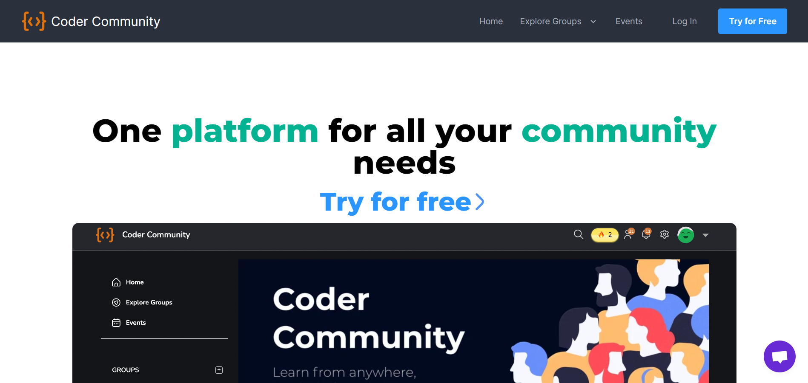

# Pensil Community Page Hackathon Project

## Live Project:
This project is deployed in Netlify Service.

[Live Link](https://pensil-community-page.netlify.app/)

## Discription:
This Community Landing page is allows users to join the groups and grow their community. User can login and start their network.

## Time taken to finish this project⏲

-  Around 2-3 days.

#### Screenshot

